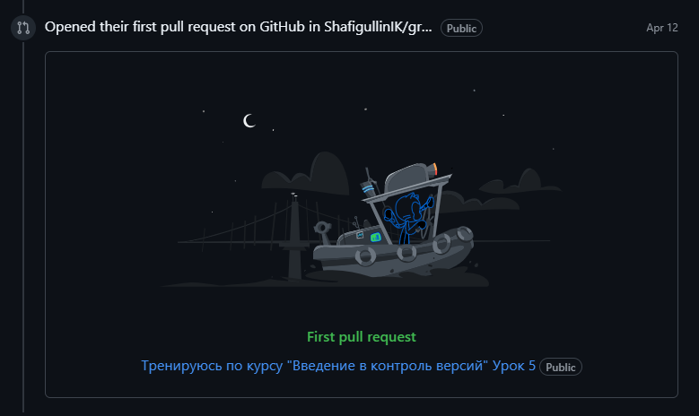

# Инструкция для работы с Markdown
*В рамках факультативного курса на GeekBrains "Введение в контроль версий"*

## Выделение текста

*Курсив* : Чтобы выделить текст курсивом необходимо обрамить его звездочками ( * ) или знаком нижнего подчеркивания ( _ ). Например, *вот так* или _вот так_.

**Полужирный** : Чтобы выделить текст полужирным, необходимо обрамить его двойными звездочками (**) или двойные знаки нижнего подчеркивания ( __ ). Например **вот так** или __вот так__.

Альтернативные способы выделения текста жирным или курсивом нужны для того, чтобы мы могли совмещать оба этих способа. Например, _текст может быть выделен курсивом и при этом быть **полужирным**_.

## Списки

Чтобы добавить ненумерованные списки, необходимо пункты выделить звездочкой [ * ] или знаком [ + ]. Например, вот так:
* Элемент 1
* Элемент 2
+ Элемент 3
+ Элемент 4

Чтобы добавить нумерованные списки, необходимо пункты просто пронумеровать. Например, вот так:
1. Первый пункт
2. Второй пункт

## Цититирование

> Первый уровень
>> Второй уровень

## WEB cсылки

Git для новичков [часть 1](https://habr.com/ru/articles/541258/ "Хабр")

Git для новичков [часть 2](https://habr.com/ru/articles/542616/ "Хабр") в кавычках через пробел после ссылки до закрывающей скобки можно вставить "Всплывающую подсказку"

[Git на Attlassian. Настройка репозитория](https://www.atlassian.com/ru/git/tutorials/setting-up-a-repository "Attlassian")

## Работа с изображениями

Чтобы вставить изображение:

! вначале поставить восклицательный знак, далее:

в [ ] указывается текст - на случай, если изображение не загрузится

в ( ) указывается имя файла из которого это изображение необходимо "достать". Изображение должно лежать в той же папке, что и файл .md

## Работа с таблицами
Смотреть в файле `instruction.md` у Дениса Гуляева в репозитории version_control

## Убрать под спойлер

  Вот так можно убрать под спойлер.
  
  А, как убрать под спойлер, чтобы вместо "Сведения" выводился текст?

  
<strong>Допустим это заголовок спойлера</strong>

  А вот так

  Смотри код

---

## А это мой первый pull request

